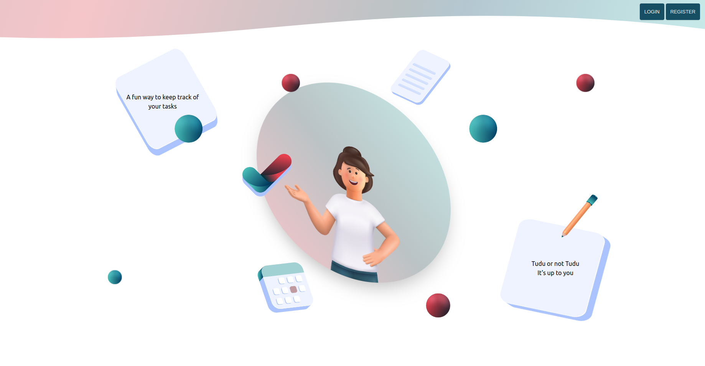

# TUDU - React To-Do App (In Progress)
Explore the [React To-Do App](https://tudu-bcode.netlify.app/)!

#### Note: This project was initially crafted a year ago during my coding bootcamp journey. Now, fueled by a desire for continuous improvement, I'm revisiting TUDU to enhance its features, refine code, and address existing challenges.

## Screenshots

## Goals:
1. Database and Backend:
- refine database schema for better performance;
- optimize backend logic;
2. Code Quality: 
- review and enhance code for clarity;
- implement React best practices;
3. New Features:
- user profile system;
- explore additional task management features;
4. User Experience:
- address login and registration issues;
- improve overall user experience.

## Technologies Used

- React.js
- Tailwind CSS
- useForm
- react-select
- framer motion

## Installation and Usage

1. Clone the repository: `git clone https://github.com/Arseniia-Damaksina/tudu.git`
2. Install dependencies: `npm install`
3. Start the application: `npm start`
4. Open [http://localhost:3000](http://localhost:3000) to view it in the browser.